# AI エージェントハンズオン～ObjectScript SDK でエージェント作ってみよう！～

このリポジトリは、早期アクセスプログラムで公開中の「InterSystems AI Hub」を使用して、実際にコードを記述しながら AI エージェントの開発を体験するためのコード一式が含まれています。

AI エージェントと AI チャットの違いを確認したい場合や、ハンズオン前にコード例を眺めて大枠を掴みたい場合は、以下ウェビナーアーカイブをご視聴ください。
- 第1回：[はじめての AI エージェント開発 ～InterSystems AI Hub で学ぶ Agent・Tool・MCP～](https://event.on24.com/wcc/r/5402618/0E6DA095D2FC543ABF49B1B2E445389D)
- 第2回：[AI エージェント開発実践編～ObjectScript SDK で理解する Agent・Tool・MCP～](https://event.on24.com/wcc/r/5420406/F42B308B5C7621F6FEF628F8E545762A)


**💡 AIHub 最新情報はこちらのリポジトリで公開中 👉 https://github.com/intersystems-community/ai-hub-eap**

- [AI エージェントハンズオン～ObjectScript SDK でエージェント作ってみよう！～](#ai-エージェントハンズオンobjectscript-sdk-でエージェント作ってみよう)
  - [事前準備](#事前準備)
    - [1. イメージのロード](#1-イメージのロード)
    - [2. .envの作成](#2-envの作成)
    - [3. コンテナ開始](#3-コンテナ開始)
      - [エージェントコンテナへのログイン](#エージェントコンテナへのログイン)
      - [実行テスト](#実行テスト)
    - [4. ObjectScript エクステンションパックのインストール](#4-objectscript-エクステンションパックのインストール)
  - [💻ハンズオン](#ハンズオン)
    - [このリポジトリのディレクトリ構成](#このリポジトリのディレクトリ構成)
    - [1. シンプルチャットを試す](#1-シンプルチャットを試す)
      - [1-1. チャット用クラスの作成](#1-1-チャット用クラスの作成)
      - [1-2. モデル用の設定](#1-2-モデル用の設定)
      - [1-3. システムプロンプトの指定](#1-3-システムプロンプトの指定)
      - [1-4. チャット実行](#1-4-チャット実行)
      - [1-5. セッションを確認](#1-5-セッションを確認)
      - [🤖まとめ](#まとめ)
    - [2. 売上分析エージェントを作る](#2-売上分析エージェントを作る)
      - [2-1. 事前準備](#2-1-事前準備)
      - [2-2. エージェント用クラスの確認](#2-2-エージェント用クラスの確認)
      - [2-3. 用意するツールの内容](#2-3-用意するツールの内容)
      - [2-4. ツール用クラスの作成と実行](#2-4-ツール用クラスの作成と実行)
      - [🤖まとめ](#まとめ-1)
    - [3. MCP サーバー機能を試す](#3-mcp-サーバー機能を試す)
      - [3-1. 使用するテーブルの確認](#3-1-使用するテーブルの確認)
      - [3-2. MCP サーバー用ツールの準備](#3-2-mcp-サーバー用ツールの準備)
      - [3-3. MCP サービス用クラス作成](#3-3-mcp-サービス用クラス作成)
      - [3-4. MCP サービスクラス用エンドポイントの作成](#3-4-mcp-サービスクラス用エンドポイントの作成)
      - [3-5. MCP サーバーリスタート](#3-5-mcp-サーバーリスタート)
      - [3-6. MCP サーバのテスト](#3-6-mcp-サーバのテスト)
      - [🤖まとめ](#まとめ-2)
    - [4. エージェントから MCP サーバー用ツールを利用する](#4-エージェントから-mcp-サーバー用ツールを利用する)
      - [4-1. ToolSet クラスの用意](#4-1-toolset-クラスの用意)
      - [4-2. エージェントの TOOLSETS を更新](#4-2-エージェントの-toolsets-を更新)
      - [4-3. テスト！](#4-3-テスト)
      - [🤖まとめ](#まとめ-3)
  - [☕付録：デモのエージェント開始方法](#付録デモのエージェント開始方法)
  - [☕付録：MCPサーバを試す](#付録mcpサーバを試す)
    - [A. MCP インスペクタで試す](#a-mcp-インスペクタで試す)
    - [C. Claude Desktopを使う](#c-claude-desktopを使う)


## 事前準備

初回のみ、コンテナ内で使用するシェルに権限付与のため、以下実行してください。

> [!Note] 
> Docker Desktop for Windows を使用されている場合は、以下のシェル実行は不要です。

```
./init.sh
```
> [!Note] 
> このリポジトリでは、Docker compose V2 で動作するコンテナログイン方法を記載しています
> 
> docker compose （スペースあり）が使える環境を前提としています（docker compose version の実行結果が、Docker Compose version v2.xx.x と表示されていれば V2 の環境です）。

### 1. イメージのロード

> [!Note] 
> このリポジトリでは、コンテナ版 IRIS を利用しています。
> - 早期アクセスプログラムのキットは、リリース前のため、キットの入れ替えより動作が変わる可能性があります。予めご了承ください。
> - このリポジトリは、**ビルド136** で動作確認を行っています。

事前に **[コミュニティエディションダウンロードページ](https://evaluation.intersystems.com/Eval/index.html)** にアクセスし、**Early Access Program** のアイコンをクリックします。

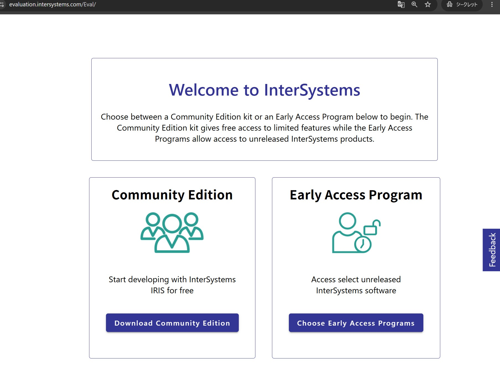

> 💡事前にアカウント登録が必要です。詳細は「[InterSystems IRIS／InterSystems IRIS for Health コミュニティエディションのダウンロード方法](https://jp.community.intersystems.com/node/530121)」をご参照ください。

**Choose Early Access Programs** の画面の①で **AI Hub** を選択後、②でご利用環境に合わせたコンテナイメージファイルをダウンロードしてください。
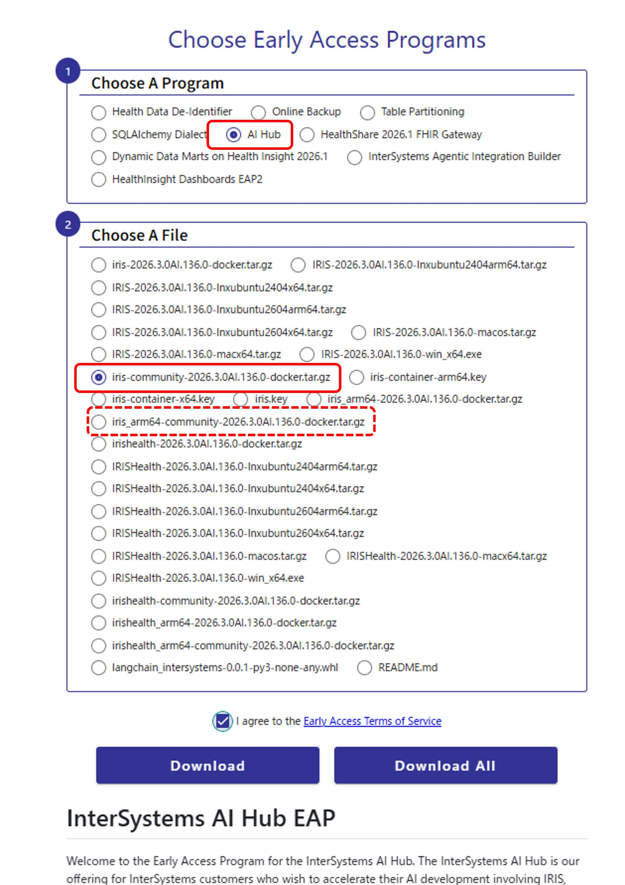

> arm64 の場合は、**iris_arm64-community-2026.3.0AI.136.0-docker.tar.gz** をダウンロードしてください。

---
ロード例（ファイル名はダウンロード時点のものに置き換えて実行してください）：
```
docker load -i iris-community-2026.3.0AI.136.0-docker.tar.gz
```


`docker load` 後のイメージ名は、以下の通りです。

```
docker.iscinternal.com/docker-intersystems/intersystems/iris-community:2026.3.0AI.136.0
```

> [!Warning]
> 入手される時期や、ARM64 用の場合にイメージ：タグ名が異なる場合があります。

異なる場合は、以下、Dockerfile に記載のイメージ：タグ名を修正してください。

- IRIS コンテナの [agent/Dockerfile](./agent/Dockerfile)


ご参考：コンテナ全体のイメージ図
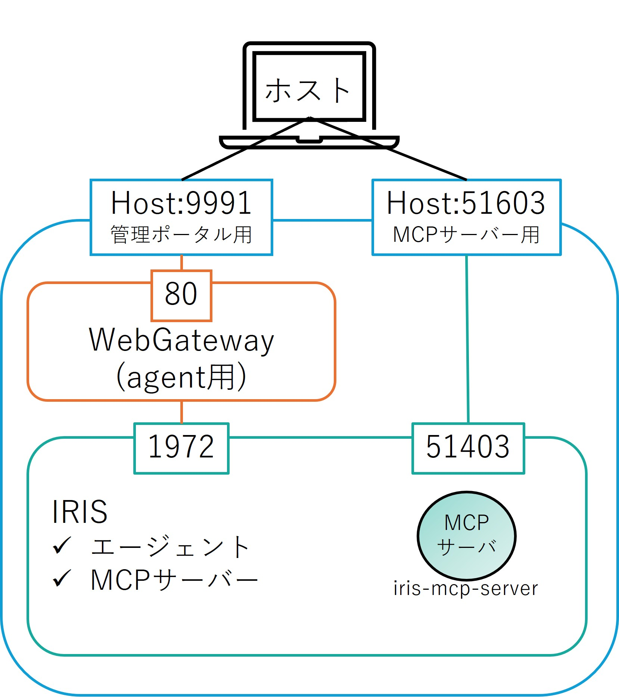

### 2. [.env](./.env)の作成

git clone で作成されたリポジトリのディレクトリに移動し、その場所に .env を作成します。

> [!Note] 
> Zip でダウロードされた場合は、解凍後、README.MD があるディレクトリに移動して、その場所に .env を作成して下さい。

**必須で設定するのは、OpenAI の APIキーのみです。**

デモアプリを動かしたい場合は、エージェント内の Web 検索に [Brave サーチ](https://brave.com/search/api/)を使用しているため、Brave の API キーを入手し、設定します。

> [!Note] 
> デモアプリを動かさない場合は、`BRAVE_SEARCH_API_KEY` は、設定不要です。
```
OPENAI_API_KEY=xxx
BRAVE_SEARCH_API_KEY=
IRISNAMESPACE=T1
```

### 3. コンテナ開始

```
docker compose up -d
```

コンテナを開始すると同時に、MCP サーバーも開始します。

> コンテナには、ウェビナーデモで使用していたコードも含まれています。

#### エージェントコンテナへのログイン

コンテナへのログインは、以下
```
docker compose exec agent bash
```
#### 実行テスト

ハンズオン前に、コンテナが正しく動作するかエージェントのテストをします。

エージェント用コンテナへログイン後、テストメソッドを実行し、実行例のような回答が得られるかご確認ください。

> [!Note] 
> エラーが返る場合は、ハンズオン担当者にご連絡ください。

コンテナにログイン：
```
docker compose exec agent bash
```
IRIS にログイン（T1ネームスペースにログイン）：
```
iris session iris -U T1
```

テストエージェント実行：
```
do ##class(Demo.Agent.PreparingMeeting).TestChat()
```
> [!Note] 
> MCP サーバーの開始に少し時間がかかるため、コンテナ開始後、少し待ってから実行してください。

<details>
<summary><b>🔍実行例（クリックすると展開されます）</b></summary>
<div>

```
T1>do ##class(Demo.Agent.PreparingMeeting).TestChat()
Provider: OpenAI
Model: gpt-4.1-mini

=== LLM が返したテキスト ===
{"customerName":"ABC商事","meetingPurpose":"AIエージェントを使った営業・サポート部門の情報統合デモ相談","customerSummary":"製造業、関東地域に拠点を持ち、従業員数5200名。主にERP、生産管理、データウェアハウスを利用。現在、生成AI活用、データ統合、既存システム連携に関心があり、部門ごとに顧客・在庫・問い合わせ情報が分散し、会議前の情報収集に時間がかかる課題を抱えている。DX推進室が主導し、現場部門にも説明しやすい短いデモを希望。","keyPeople":[{"name":"鈴木 一郎","role":"DX推進室 室長","interestArea":"AIエージェント, 業務効率化","notes":"会議準備や社内問い合わせ対応でAIエージェントを試したいと発言。要点を先に知りたい。営業部門でも理解できる短いデモを希望。"},{"name":"高橋 由美","role":"情報システム部 課長","interestArea":"既存システム連携, 権限管理","notes":"MCPで既存APIを安全に公開できるか確認したい。技術的な裏付けを重視。権限管理と監査ログの確認を希望。"}],"recentTopics":[{"source":"CustomerNews","summary":"ABC商事は製造現場と営業部門のデータ連携を強化する方針を発表。既存システムとAI活用を組み合わせ、業務効率化を進める。"},{"source":"CustomerNews","summary":"営業活動に必要な顧客情報、問い合わせ情報、過去提案資料を横断的に参照できる仕組みを検討している。"},{"source":"MeetingMinutes","summary":"会議準備エージェントの出力には、顧客概要、前回会議からの変化、現在の課題、確認事項、推奨アジェンダを含めたい。"}],"openIssues":[{"source":"SupportTicket","summary":"営業担当者が会議前に未解決問い合わせと過去の重要問い合わせを短時間で把握したい。","priority":"Medium"},{"source":"SupportTicket","summary":"MCP経由で既存システムの情報を取得する場合、ユーザー権限と監査ログをどう扱うか確認したい。","priority":"Low"}],"preparationItems":["ABC商事向けのブリーフィング自動生成デモ資料準備","MCPツールの権限管理と監査ログに関する技術的説明資料準備","過去の議事録とサポート履歴の要点整理資料作成","顧客の現在の課題と関心領域に沿った提案ポイントの整理"],"toolUseSummary":[{"toolName":"mcp_meetingservice_GetCustomerID","result":"ABC商事の顧客IDをC001として取得"},{"toolName":"mcp_meetingservice_GetCustomerInfo","result":"顧客概要、課題、関心領域、次回会議目的などを取得"},{"toolName":"mcp_meetingservice_GetCustomerContacts","result":"主要担当者鈴木一郎（DX推進室 室長）、高橋由美（情報システム部 課長）を取得"},{"toolName":"mcp_meetingservice_GetMeetingMinutes","result":"過去2回の議事録から会議準備自動化の要望、デモ内容の決定事項を取得"},{"toolName":"mcp_meetingservice_GetSupportTicket","result":"過去の問い合わせチケットから未解決のサポート課題と権限管理の質問を取得"},{"toolName":"mcp_meetingservice_GetCustomerNews","result":"製造現場のDX投資拡大と営業部門の情報共有基盤見直しに関する最新ニュースを取得"}]}

T1>
```
</div>
</details>

### 4. ObjectScript エクステンションパックのインストール

事前準備最後は、VSCode に [ObjectScript エクステンションパック](https://marketplace.visualstudio.com/items?itemName=intersystems-community.objectscript-pack) のインストールです。

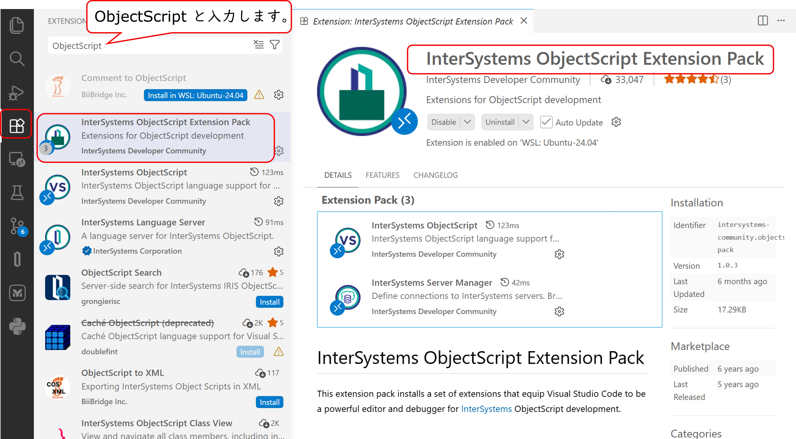

VSCode のエクステンション用アイコンをクリックし「ObjectScript」でフィルタ指定して、エクステンションを探します。**InterSystems ObjectScript Extention Pack** をインストールしてください。

## 💻ハンズオン

このハンズオンで作成するAIエージェント

- エージェントの作成
- Session を利用
- ローカル Tool を作成
- MCP Tool を公開
- MCP Tool を利用
- 完成

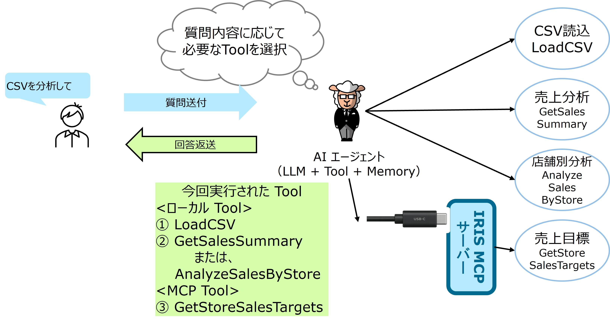

### このリポジトリのディレクトリ構成
```text
.
├── agent
├── assets
└── webgateway-agent
```
各ディレクトリの内訳は、以下の通りです。

ディレクトリ名|含まれる内容
--|--
agent/src/data|デモで使用しているダミーデータの CSV ファイル
agent/src/Demo/Agent|デモ用のエージェント、ツール、セッション管理用クラス
agent/src/Demo/Interop|Human in the Loop 用デモのプロダクション一式
agent/src/Demo/Service <br>agent/src/Demo/Tool |MCP サーバー用クラス定義
**agent/src/FS**| **💡ハンズオンで使用するCSV、SQL文を含むディレクトリ<br>また、作成するクラスをこのディレクトリに配置します。**
**agent/src/FS/Sample**|**💡ハンズオンのサンプルコード**
**agent/src/MCPFS**|**💡ハンズオンで作成するMCP用クラスを配置するディレクトリ**
agent/src/sql|デモで使用している外部テーブルの定義一式
agent/src/web1|デモ用 Web アプリ（第1回ウェビナーデモ）
agent/src/web2|デモ用 Web アプリ（Human in the Loop 版）
agent/|MCPサーバー起動停止用シェル、MCPサーバー接続テスト用ファイル（mcptest.http）、コンテナ開始時スクリプト
assets/|README 用画像置き場
webgateway-agent/|コンテナ用 webgateway

<br>

ホストが使用するポートは、以下の通りです。

ポート|内容
--|--
9001|エージェントコンテナの管理ポータル用ポート番号
51603|MCP サーバー用ポート


<br>

### 1. シンプルチャットを試す

- ■■■ 今回やること ■■■

    ■ AI とチャットする

    □ エージェントの作成

    □ ツールの追加

    □ MCP 追加

    □ 完成

---
エージェント作成の基本となる、`%AI.Agent` クラスを継承したクラス定義を用意し、AI とチャットしながら、エージェントに必要な会話履歴（Memory）の中身について確認します。

ここからは、VSCode をエージェント用コンテナの IRIS に接続し、エージェント用クラス定義を作成します。

InterSystems アイコンをクリックし、`Choose Server and Namespace` をクリックし、接続サーバ名：`agent` を選択 > `T1`　ネームスペースを選択します。

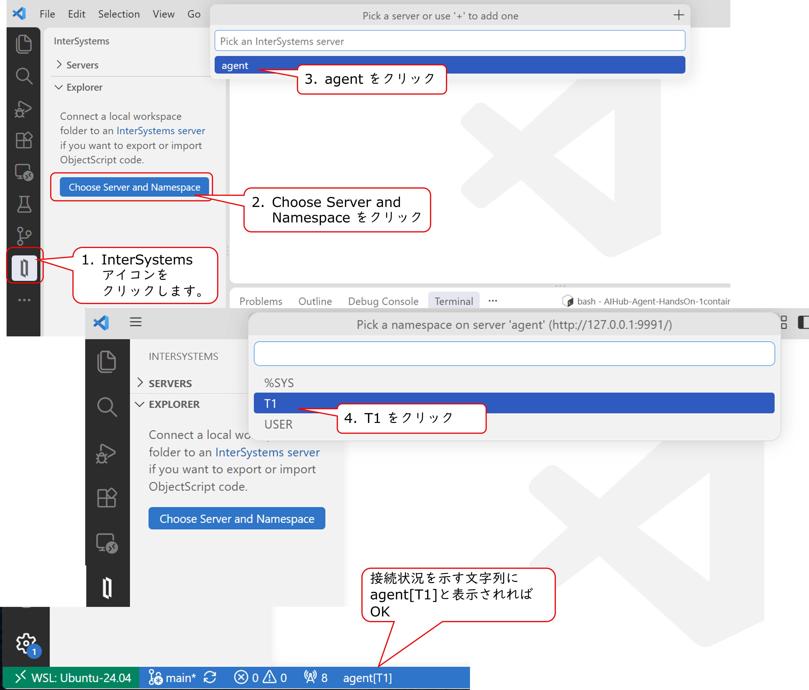

ユーザ名：`SuperUser` に対してパスワード入力を求められたら `SYS`　を入力します。


#### 1-1. チャット用クラスの作成

[agent/src/FS](./agent/src/FS/) に `ChatTest.cls` の名称で新規ファイルを作成します。

ファイルの先頭に、クラス定義文が表示されます。`Extends` 右隣に記載のスーパークラスの名称を `%RegisteredObject` から `%AI.Agent` に変更します。

```objectscript
Class FS.ChatTest Extends %AI.Agent
```
変更後、一旦保存します（Ctrl + s）。

#### 1-2. モデル用の設定

設定に必要な `Parameter` 定義をオーバーライドします。

クラス定義の {} 内にカーソルを置き、右クリック > `Override Class Members...` を選択します。

> カーソルを置いた場所に転記されます。

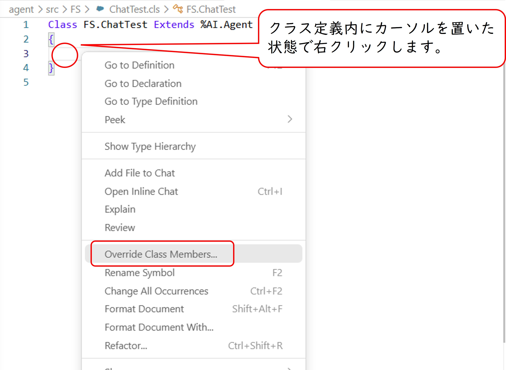

Parameter を選択します。

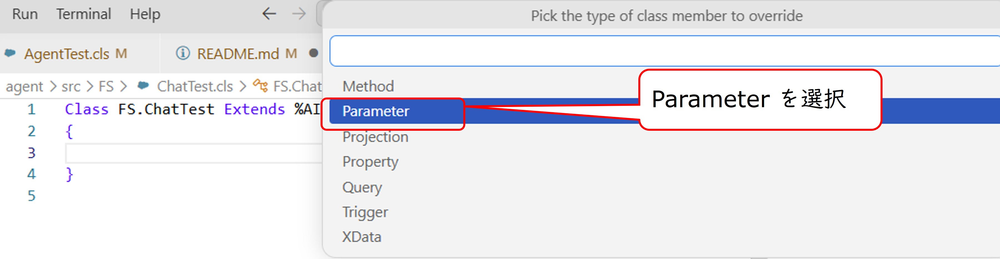

APIKEY、MODEL、PROVIDER をチェックし、OK ボタンをクリックすると、カーソルと置いた位置に `Parameter` 定義と説明文（/// で始まる行）が転記されます。

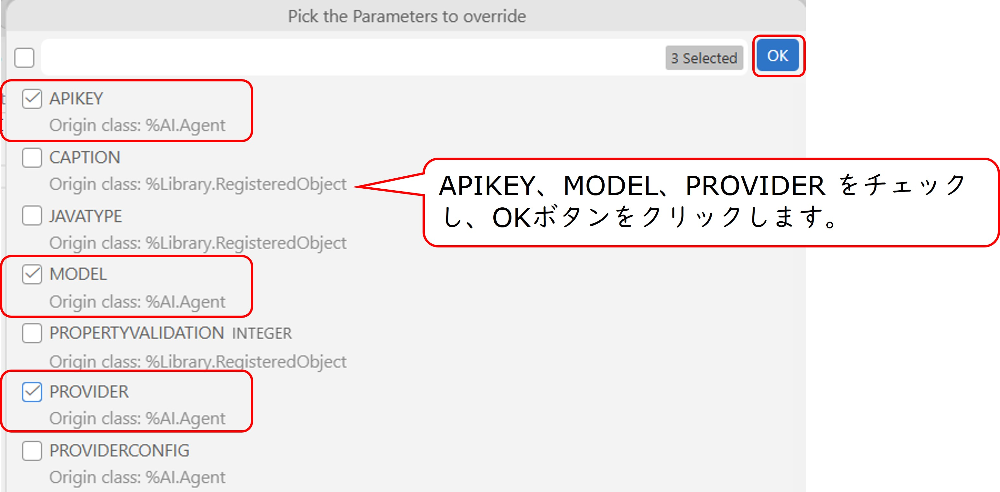

```ObjectScript
/// API key for the provider. Supports @{prefix.key} placeholders:
///   Parameter APIKEY = "@{env:OPENAI_API_KEY}";
///   Parameter APIKEY = "@{wallet.MySecrets.OpenAIKey}";
Parameter APIKEY;

/// Default Model ID
Parameter MODEL;

/// Default LLM Provider name (e.g., "openai", "anthropic", "vertex")
Parameter PROVIDER;
```

3 つのパラメータに以下の値を登録します。値は、二重引用符で囲います。
パラメータ名|値
--|--
APIKEY|"@{env:OPENAI_API_KEY}"
MODEL|"gpt-4.1-mini"
PROVIDER|"OpenAI"

設定例は以下の通り：

```ObjectScript
Parameter APIKEY="@{env:OPENAI_API_KEY}";

Parameter MODEL="gpt-4.1-mini";

Parameter PROVIDER="OpenAI";
```


#### 1-3. システムプロンプトの指定

システムプロンプトをエージェント用クラスに定義しておくことも、動的に設定することもできますが、ハンズオンではクラス定義に事前に定義しておく方法を試します。

パラメーター定義と同じ方法で、Override メニューから `XData` ブロックの `INSTRUCTIONS` をオーバーライドします。

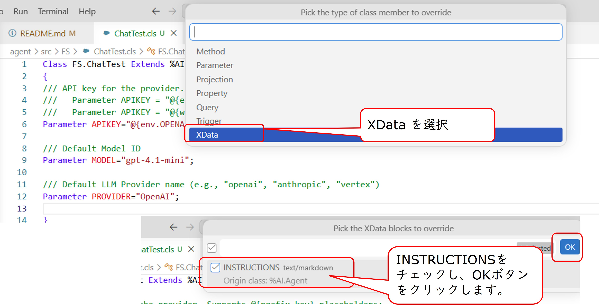

```ObjectScript
/// Instructions/prompt for this agent
XData INSTRUCTIONS [ MimeType = text/markdown ]
{
	
}
```
`{}` の中はマークダウンでシステムプロンプトを記述できます。

以下のプロンプトを記入してファイルを保存（Ctrl + s）してください。
```
あなたは分析アシスタントです。

ユーザから分析の依頼を受けたら、次のように回答してください。

- データがある場合は分析結果を説明する
- データがない場合は分析の観点を提案する
- 回答はJSON形式で返してください

{
  "Summary":"",
  "HowToAnalytics":[]
}
```

#### 1-4. チャット実行

早速、IRIS ログインしてチャットを実行してみましょう！

VSCode の新規ターミナルを開き、コンテナにログインします。
```
docker compose exec agent bash
```
IRISにログインします（T1ネームスペースにログイン）。
```
iris session iris -U T1
```
>[!Note] 
> ヒント : ObjectScript では、変数、パッケージ名、クラス名、メソッド名、プロパティ名、パラメータ名は大小文字を区別します。** コマンド、関数、特殊変数は区別しませんが、記述に慣れるまで「大小文字を区別する」ものとして記述してください。

エージェント用クラスのインスタンスを作成し、任意の変数に設定します。

> [!Note] 
> ビルド136の環境では、OS環境変数に設定したAPIキー情報がうまく取得できないため、変数 provider の設定を行っています。

> `SET`コマンドを使用して変数に値を割り当てます。
```
set agent=##class(FS.ChatTest).%New()
```
続いて、設定したプロバイダーやモデル、APIキーを適用するために初期化処理を実行します（`%Init()` メソッドを実行します）。
```
write agent.%Init()
```
1 が返れば初期化処理成功です。

> 1以外が返る場合は、エラーが発生しています。`do $system.OBJ.DisplayError()` を実行してエラーメッセージを確認してください。

次に、会話履歴を格納するセッションを作成します。
```
set session=agent.CreateSession()
```
いよいよチャット開始です。

第 1 引数に作成したセッション、第 2 引数に質問文を任意文字列で指定します。
```
set resp=agent.Chat(session,"売上データを分析するとき、どんな観点で確認すればよいですか？")
```

LLM から戻る回答を表示します。

> `WRITE` コマンドは、標準出力コマンドで引数にした内容を出力します。
```
write resp.Content
```

現時点の表示には、改行や空白などが含まれ見づらいと思います。

現在のシステムプロンプトに、回答方法についての指示を加えます。
回答用 JSON の形式指定の直前に、以下の制約を追加しクラス定義を保存します。

再度、エージェントのインスタンス生成のところからやり直して結果が変わるかご確認ください。

```
回答は必ず以下のJSON形式で返してください。
- 出力はJSONのみ。
- Markdownは禁止。
- JSONは1行のコンパクト形式で返してください。
- 存在しない情報は空文字または空配列にしてください。
```
**💡ターミナル実行内容をクラスメソッド化すると簡単に実行できるようになります。**

クラスメソッド例）

```ObjectScript
ClassMethod Test()
{
    set agent=##class(FS.ChatTest).%New()
    $$$ThrowOnError(agent.%Init())
    set session=agent.CreateSession()
    set resp=agent.Chat(session,"交通量を分析するとき、どんな観点で確認すればよいですか？")
    write resp.Content  
}
```

クラスメソッドの実行は、以下の通りです。

> `DO` コマンドを使用します。戻り値のないメソッドや関数を実行する場合に使用するコマンドです。
```
do ##class(FS.ChatTest).Test()
```
結果が変わったでしょうか？

サンプル：[agent/src/FS/Sample/ChatTest.cls](./agent/src/FS/Sample/ChatTest.cls) には、より具体的な指示を記述しているシステムプロンプトを使用しています。書き換えて実行するなど、自由にお試しください。

#### 1-5. セッションを確認

チャットの会話履歴が、どのように IRIS で管理されるか確認してみましょう。

AI とのチャットに使用していた IRIS ターミナル上で、現在使用中のエージェントのインスタンスを破棄するため、`KILL` コマンドを実行します。

> `KILL` コマンドを引数無しで実行します。ターミナルプロセスにある変数を全消去します。（変数に割り当てたインスタンスも解放されます。）
```
kill
```

1 回目のチャットの会話を実行します。
```
set agent=##class(FS.ChatTest).%New()
write agent.%Init()
set session=agent.CreateSession()
set resp=agent.Chat(session,"売上データを分析するとき、どんな観点で確認すればよいですか？")
write resp.Content

```
別の質問に変え、実行してみます。
```
set resp=agent.Chat(session,"気象データを分析するとき、どんな観点で確認すればよいですか？")
write resp.Content
```
さらに別の質問で実行してみます。
```
set resp=agent.Chat(session,"交通量と交通事故の関係を分析するとき、どんな観点で確認すればよいですか？")
write resp.Content
```
会話の統計情報を確認します。
```
set stats = session.GetStats()
```
会話のやりとりの回数、プロンプトのトークン数などを確認します。
```
Write "会話の往復数：", stats."total_interactions", !
Write "入力トークン数：", stats."total_prompt_tokens", !
Write "出力トークン数：", stats."total_completion_tokens", !
Write "Tool 呼び出し回数：", stats."total_tool_calls", !
Write "LLM 応答時間：", stats."total_llm_duration_ms", "ms", !
```

今までのやり取りを、一旦保存します。
```
write session.%Save()
```
1 が戻ればデータベースに保存完了です。

> 1以外が返る場合は、エラーが発生しています。`do $system.OBJ.DisplayError()` を実行してエラーメッセージを確認してくださ

保存した後は、テーブル（`%AI_Agent.Session`）で中身を確認できますが、会話履歴はストリームとして保存されるため、全貌を確認するにはターミナルが適しています。
```
write session.ContextData.Read()
```
ちょっと見づらいですが、今までの会話履歴が表示されたことを確認できます。

ここで、セッションの `ID` を確認します。

```
write session.%Id()
```
出力される番号をメモします。

<details>
<summary><b>🔍実行例（クリックすると展開されます）</b></summary>
<div>

```
T1>Write "会話の往復数：", stats."total_interactions", !
会話の往復数：3

T1>Write "入力トークン数：", stats."total_prompt_tokens", !
入力トークン数：1291

T1>Write "出力トークン数：", stats."total_completion_tokens", !
出力トークン数：688

T1>Write "Tool 呼び出し回数：", stats."total_tool_calls", !
Tool 呼び出し回数：0

T1>Write "LLM 応答時間：", stats."total_llm_duration_ms", "ms", !
LLM 応答時間：11003ms

T1>write session.%Save()
1
T1>write session.ContextData.Read()
{"version":1,"messages":[{"role":"system","content":"あなたは分析アシスタントです。\n\nユーザから分析の依頼を受けたら、次のように回答してください。\n\n- データがある場合は分析結果を説明する\n- データがない場合は分析の観点を提案する\n- 回答はJSON形式で返してください\n\n回答は必ず以下のJSON形式で返してください。\n- 出力はJSONのみ。\n- Markdownは禁止。\n- JSONは1行のコンパクト形式で返してください。\n- 存在しない情報は空文字または空配列にしてください。\n\n{\n  \"Summary\":\"\",\n  \"HowToAnalytics\":[]\n}"},{"role":"user","content":"売上データを分析するとき、どんな観点で確認すればよいですか？"},{"role":"assistant","content":"{\"Summary\":\"売上データ分析では、全体の売上推移、商品別・カテゴリ別売上、顧客属性別売上、地域別売上、時系列分析（季節性やトレンド）、キャンペーンやプロモーションの効果、販売チャネル別売上などの観点で確認するとよい。\",\"HowToAnalytics\":[\"売上推移の時系列分析でトレンドや季節性を把握する\",\"商品やカテゴリごとに売上構成比や成長率を分析する\",\"顧客属性（年齢、性別、地域など）ごとの売上傾向を確認する\",\"地域別の売上分布や市場シェアを評価する\",\"キャンペーンやプロモーション実施前後の売上変化を比較する\",\"販売チャネル（オンライン、店舗など）別の売上実績を比較する\",\"利益率や原価を含めた収益性の観点も加味する\"]}"},{"role":"user","content":"気象データを分析するとき、どんな観点で確認すればよいですか？"},{"role":"assistant","content":"{\"Summary\":\"気象データ分析では、気温、降水量、風速、湿度などの基本的な気象要素の時系列変化、季節変動や異常気象の検出、地域差の解析、気象要素間の相関関係、気象パターンの分類や予測モデルの構築などの観点で確認するとよい。\",\"HowToAnalytics\":[\"気温や降水量などの時系列データを用いて季節変動やトレンドを把握する\",\"異常気象（猛暑、豪雨、台風など）の発生頻度や影響を分析する\",\"地域ごとの気象パターンや傾向の違いを比較する\",\"気温、湿度、風速など複数の気象要素間の相関関係を調べる\",\"気象データをクラスタリングしてパターン分類を行う\",\"予測モデル（例えば気温や降水量の予測）を構築し未来の気象を推定する\"]}"},{"role":"user","content":"交通量と交通事故の関係を分析するとき、どんな観点で確認すればよいですか？"},{"role":"assistant","content":"{\"Summary\":\"交通量と交通事故の関係を分析する際は、交通量の多い時間帯や場所での事故発生率、事故の種類や重症度、時間帯・曜日・季節ごとの傾向、交通量の増減と事故数の相関、道路環境や天候などの外部要因の影響などを確認するとよい。\",\"HowToAnalytics\":[\"時間帯別・曜日別の交通量と事故発生件数の比較\",\"地点別（交差点、高速道路など）での交通量と事故の頻度分析\",\"交通量の増減に伴う事故発生率の相関分析\",\"事故の種類（追突、歩行者関連など）や重症度別の発生傾向の確認\",\"天候や道路状況と交通量・事故発生の関連性の検証\",\"交通規制や安全対策の実施前後での交通量と事故数の変化分析\"]}"}],"checkpoints":[],"stats":{"total_interactions":3,"total_prompt_tokens":1291,"total_completion_tokens":688,"total_reasoning_tokens":0,"total_cache_creation_tokens":0,"total_cache_read_tokens":0,"total_tool_calls":0,"total_llm_duration_ms":11003,"total_tool_duration_ms":0}}
T1>write session.%Id()
1
```

</div>
</details>
<br>

一旦、エージェントのインスタンスを消去し、AI チャットを終了します。
```
kill
```
再度、チャットを開始するため、エージェントのインスタンス、初期化を行います。
```
set agent=##class(FS.ChatTest).%New()
write agent.%Init()
```
ここで、保存していたセッションをオープンし、保存した会話の後からチャットを再開してみます。

先ほど確認したセッションの `ID` を指定してオープンします（例は 1 を指定しています）。
```
set session=##class(%AI.Agent.Session).%OpenId(1)
write agent.%InitWithSession(session)
```
> 1以外が返る場合は、エラーが発生しています。`do $system.OBJ.DisplayError()` を実行してエラーメッセージを確認してください。

新しい質問を入力します。
```
set resp=agent.Chat(session,"今まで質問した分析内容で共通する観点を教えてください。")
write resp.Content
```
セッションの統計情報を再度確認します。
```
set stats = session.GetStats()
Write "会話の往復数：", stats."total_interactions", !
Write "入力トークン数：", stats."total_prompt_tokens", !
Write "出力トークン数：", stats."total_completion_tokens", !
Write "Tool 呼び出し回数：", stats."total_tool_calls", !
Write "LLM 応答時間：", stats."total_llm_duration_ms", "ms", !
```
どうでしょうか。会話の往復数が保存時から 1 つ増えていることを確認できたでしょうか。

<details>
<summary><b>🔍実行例（クリックすると展開されます）</b></summary>
<div>

```
T1>kill

T1>set agent=##class(FS.ChatTest).%New()

T1>write agent.%Init()
1
T1>set session=##class(%AI.Agent.Session).%OpenId(1)

T1>write agent.%InitWithSession(session)
1
T1>set resp=agent.Chat(session,"今まで質問した分析内容で共通する観点を押せいてください。")

T1>write resp.Content
{"Summary":"売上データ、気象データ、交通量と交通事故データの分析で共通する観点は、時系列分析によるトレンドや季節変動の把握、多様な要素やカテゴリごとの比較・分類、相関関係の検討、異常値やパターンの検出、外部要因の影響評価、及び予測や効果検証の実施が挙げられる。","HowToAnalytics":["時系列データを用いたトレンド・季節性の分析","カテゴリや地域などの属性ごとの比較・分類","複数の要素間の相関関係の検討","異常値やイベントの検出・分析","外部環境要因（天候、キャンペーン、安全対策など）の影響評価","分析結果を基にした予測モデル構築や効果検証"]}
T1>

T1>set stats = session.GetStats()

T1>Write "会話の往復数：", stats."total_interactions", !
会話の往復数：4

T1>Write "入力トークン数：", stats."total_prompt_tokens", !
入力トークン数：2238

T1>Write "出力トークン数：", stats."total_completion_tokens", !
出力トークン数：895

T1>Write "Tool 呼び出し回数：", stats."total_tool_calls", !
Tool 呼び出し回数：0

T1>Write "LLM 応答時間：", stats."total_llm_duration_ms", "ms", !
LLM 応答時間：14650ms
```

</div></details>

<br>

確認が終了したら、`KILL` コマンドを実行して使用していたインスタンスを破棄します。
```
kill
```

#### 🤖まとめ

`%AI.Agent` クラスを継承したクラスを用意し、使用したい LLM の名称、モデル、APIキーを指定のパラメータに、システムプロンプトを指定の XData ブロックに設定すれば簡単に AI とのチャットが行えることが確認できました。

また、エージェントに必要な会話履歴についても、Session（`%AI.Agent.Session`）クラスで保存、ロードなど、自由に行えることも確認できました。

### 2. 売上分析エージェントを作る

- ■■■ 今回やること ■■■

    □ AI とチャットする

    ■ エージェントの作成

    □ ツールの追加

    □ MCP 追加

    □ 完成

---

ここからは、Tool を自分で選び実行する🤖**店舗売上 CSV から、売上分析結果を回答するエージェント** を作成します。

サンプルの店舗別、商品別、カテゴリ別の売上が記録されている CSV（[agent/src/FS/SalesData.csv](./agent/src/FS/SalesData.csv)）は、以下の通りです。

```
SaleDate,Store,Product,Category,Quantity,Amount
2026-06-01,札幌店,商品A,食品,12,24000
2026-06-01,旭川店,商品B,日用品,5,10000
2026-06-02,札幌店,商品A,食品,15,30000
2026-06-02,函館店,商品C,飲料,20,18000
```

この CSV をエージェントに渡すと、質問内容に合わせて分析に必要なツールを選び、実行し、分析結果を返します。

ツールとして必要になる処理は以下の通りです。

> CSV は、毎回分析に必要な分のデータが送付されてくると仮定し、分析依頼時にテーブルに含まれている情報を全て消去するようにします。

- 既存データがあればテーブルの中身を消去する
- CSV をテーブルに登録する
- 登録件数を数える
- 店舗別売上サマリを返す
- 売上サマリを返す

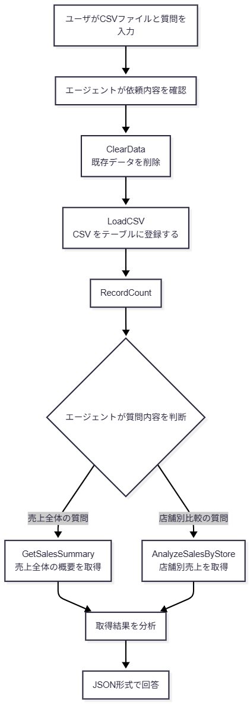

#### 2-1. 事前準備

サンプル CSV に合わせたテーブルを定義します。

**管理ポータル > システムエクスプローラ > SQL** を開き、T1 ネームスペースに接続していることを確認後、以下の SQL 文を実行します。

http://localhost:9991/csp/sys/UtilHome.csp

管理ポータルにアクセスする際に使用するユーザ名、パスワードは、以下の通りです。
- ユーザ名：**SuperUser**
- パスワード：**SYS**
  
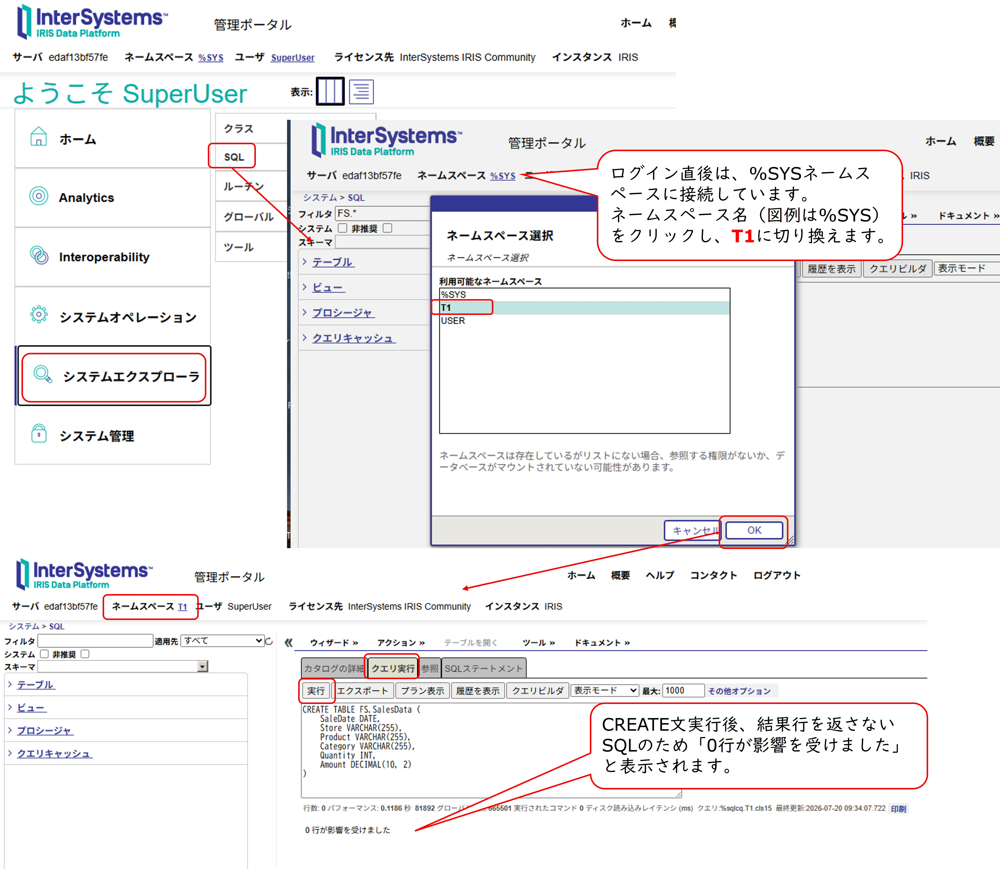

**クエリ実行タブ**に以下 CREATE 文を入力し、**実行**ボタンをクリックします。
```
CREATE TABLE FS.SalesData (
    SaleDate DATE,
    Store VARCHAR(255),
    Product VARCHAR(255),
    Category VARCHAR(255),
    Quantity INT,
    Amount DECIMAL(10, 2)
)
```

以上で準備完了です。

#### 2-2. エージェント用クラスの確認

エージェントの作成は、[シンプルチャットを試す](#1-シンプルチャットを試す) で作成した流れと同様になるため、予め用意したクラスを使用します。

クラス定義：[agent/src/FS/AgentTest.cls](./agent/src/FS/AgentTest.cls) を開き、中身を確認してください。

AI とのチャットの実行には、`TestChat()` メソッドを使用します。

```
do ##class(FS.AgentTest).TestChat()
```

現時点では、**エージェント用クラスにツールの指定はありません。**

この後の流れでツールを用意し、エージェントに登録します。

#### 2-3. 用意するツールの内容

- ■■■ 今回やること ■■■

    □ AI とチャットする

    □ エージェントの作成

    ■ ツールの追加

    □ MCP 追加

    □ 完成

---

ツールとして用意したい処理は以下の通りです。

1) 既存データがあればテーブルの中身を消去する
2) CSV をテーブルに登録する
3) 登録件数を数える
4) 売上サマリを返す
5) 店舗別売上サマリを返す

ツール用クラス定義を作成し、[agent/src/FS/ClassMethodSample.txt](./agent/src/FS/ClassMethodSample.txt) にあるサンプルコードをコピーしながらツールを作成していきます。

#### 2-4. ツール用クラスの作成と実行

[agent/src/FS/](./agent/src/FS/) ディレクトリ以下に、新しいファイルを作成し、`Tool.cls` の名称で保存します。

スーパークラスの指定を、ツール用スーパークラス `%AI.Tool` に変更し保存します（Ctrl + s）。
```
Class FS.Tool Extends %AI.Tool
```
次に、ツール用処理の 1) ～ 4) のクラスメソッドサンプルをコピーします。

> 今回は時間短縮のため、SQL 実行と返送データの作成部分は、コピーします。Tool 登録部分は自分で書きます。

[agent/src/FS/ClassMethodSample.txt](./agent/src/FS/ClassMethodSample.txt) の 1～106 行目をコピーし、クラス定義内に貼り付け保存します（Ctrl + s）。
ツールクラスの準備ができたらエージェントクラス：[agent/src/FS/AgentTest.cls](./agent/src/FS/AgentTest.cls) を開き、使用する Tool を Parameter：`TOOLSETS` に設定します。

以下の定義をエージェントクラス：[agent/src/FS/AgentTest.cls](./agent/src/FS/AgentTest.cls) に追加し、保存します（Ctrl + s）。

```
/// 使用するツールセットのクラス名を指定。複数ある時はカンマ区切り
Parameter TOOLSETS = "FS.Tool";
```
保存時、VSCode 画面右下に以下のボタンが表示されたら「Overwrite On Server」をクリックします。

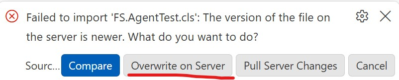

コンパイルでエラーがなかったら、早速エージェントを実行し、Tool を使用して結果を取得したか確認します。

```
do ##class(FS.AgentTest).TestChat()
```

<details><summary><b>🔍実行例（クリックすると展開されます）</b></summary>
<div>

```
T1>do ##class(FS.AgentTest).TestChat()

利用可能ツールの表示

{"Summary":"利用可能なツールは以下の通りです。functions名前空間のClearData（FS.SalesDataのデータを全消去）、GetSalesSummary（売上データの概要取得）、LoadCSV（CSVファイルのFS.SalesDataへのロード）、RecordCount（FS.SalesDataのレコード数カウント）があります。multi_tool_use名前空間のparallelは複数のfunctionsツールを同時に実行するためのラッパーです。ただし、本タスクではfunctionsツールのみをCallToolsに指定してください。","Evidence":["ClearData: FS.SalesDataのデータを全消去します。","GetSalesSummary: 売上データ全体の件数、期間、総数量、総売上、平均売上、店舗数、商品数、カテゴリー数を取得します。","LoadCSV: 指定されたCSVファイルの中身をFS.SalesDataにロードします。","RecordCount: FS.SalesDataテーブルのレコード数カウント。","multi_tool_use.parallel: 複数のfunctionsツールを同時に実行可能なラッパー。ただし本タスクはfunctionsツールをCallToolsに指定必須。"],"CallTools":["functions.ClearData","functions.GetSalesSummary","functions.LoadCSV","functions.RecordCount"]}


分析実行

{"Summary":"2026年6月1日から6月15日までの期間の売上データで、30件のレコードが含まれています。総数量は404、総売上金額は927,900円、1件あたりの平均売上は約30,930円です。店舗数は3、商品数は5、カテゴリー数は4と多様な商品と店舗を扱っています。データは中規模の売上活動をカバーしており、短期間の詳細な分析に適しています。","Evidence":["期間: 2026-06-01〜2026-06-15","記録件数: 30","総数量: 404","総売上金額: 927,900円","平均売上金額: 約30,930円","店舗数: 3","商品数: 5","カテゴリー数: 4"],"CallTools":["functions.ClearData","functions.LoadCSV","functions.GetSalesSummary"]}

```
</div>
</details>
<br>

エージェントクラス：[agent/src/FS/AgentTest.cls](./agent/src/FS/AgentTest.cls) の `TestChat()` メソッドを修正します。

質問（`question`）をサンプルの 2 行目に変更して再度実行し、質問文に対応する結果が返るか確認してください（💡修正後、クラス定義の保存 Ctrl + s を忘れずに）。

```
    // 質問サンプル
    //set question="/opt/app/FS/SalesData.csv この売上データの特徴を教えて。"
    set question="/opt/app/FS/SalesData.csv 店舗別の売上を比較して、特徴を教えて。"
```
<details><summary><b>🔍実行例（クリックすると展開されます）</b></summary>
<div>

```
T1>do ##class(FS.AgentTest).TestChat()

利用可能ツールの表示

{"Summary":"利用可能なツールは、functions名前空間内のClearData、GetSalesSummary、LoadCSV、RecordCountの4つです。ClearDataはFS.SalesDataテーブルのデータを全消去し、GetSalesSummaryは売上データ全体の概要情報を取得、LoadCSVは指定CSVファイルをテーブルにロード、RecordCountはレコード数をカウントします。multi_tool_useはfunctionsツール複数を並列で使うためのラッパーですが、指示にはCallToolsの単独使用が求められています。","Evidence":["利用可能なツールはfunctions.ClearData、functions.GetSalesSummary、functions.LoadCSV、functions.RecordCountです。","multi_tool_use.parallelは並列処理用のラッパーであり、関数namespaceのもののみ許可されています。"],"CallTools":["functions.ClearData","functions.GetSalesSummary","functions.LoadCSV","functions.RecordCount"]}


分析実行

{"Summary":"提供されたCSVファイルの売上データは6月1日から6月15日までの期間分、計30件の記録があります。合計販売数量は404個、総売上額は927,900円、平均売上は30,930円でした。データには3つの店舗、5つの商品、4つのカテゴリが含まれています。店舗別の売上比較分析により、各店舗の販売力や商品ラインナップの違いが把握可能です。","Evidence":["レコード数は30件、期間は2026年6月1日から15日です。","総販売数量は404個、総売上は927,900円、平均売上は30,930円です。","店舗数は3、商品数は5、カテゴリ数は4です。"],"CallTools":["functions.ClearData","functions.LoadCSV","functions.GetSalesSummary"]}

```
</div>
</details>
<br>

店舗別の売上を比較した結果になったでしょうか？

Tool の中に店舗別の売上を比較できる結果がないため、期待した回答にならないと思います。

ここで、Tool クラスに、店舗別の売上を返すツールを追加します。

[agent/src/FS/ClassMethodSample.txt](./agent/src/FS/ClassMethodSample.txt) の 108 行目～最終行をコピーし、Tool 用クラス定義に貼り付け保存します（Ctrl + s）。

再度、エージェントクラス：[agent/src/FS/FS.AgentTest.cls](./agent/src/FS/AgentTest.cls) の `TestChat()` を実行し、結果が変わるか確認してください。

<details><summary><b>🔍実行例（クリックすると展開されます）</b></summary>
<div>

```
T1>do ##class(FS.AgentTest).TestChat()

利用可能ツールの表示

{"Summary":"利用可能なツールは以下の通りです。1. AnalyzeSalesByStore: 店舗ごとの売上金額、販売数量、件数、平均売上の取得。2. ClearData: FS.SalesDataテーブルのデータ全消去。3. GetSalesSummary: 売上データ全体の件数、期間、総数量、総売上、平均売上、店舗数、商品数、カテゴリー数の取得。4. LoadCSV: 指定したCSVファイルをFS.SalesDataにロード。5. RecordCount: FS.SalesDataテーブルのレコード数カウント。これらはすべてfunctions名前空間にあります。","Evidence":["AnalyzeSalesByStore: 店舗ごとの売上分析が可能","ClearData: テーブルデータの全消去が可能","GetSalesSummary: 売上データ全体の概要取得が可能","LoadCSV: CSVファイルをデータベースにロード可能","RecordCount: データ件数のカウントが可能"],"CallTools":[]}


分析実行

{"Summary":"データは複数のレコードに分かれており、札幌店、函館店、旭川店の売上が含まれています。札幌店は7件の記録で総数量148、総売上296,000円、平均売上42,285円と最も売上が高いが、複数のグループに分かれている可能性があります。函館店は総数は多いが、売上と平均売上は札幌店より低く、個別の売上額にばらつきが見られます。旭川店は販売数量と売上の両方で最も小さい傾向にあります。これらの特徴から、札幌店が最も売上規模が大きく、函館店と旭川店は売上規模や取引件数にばらつきや分散が見られることが特徴です。","Evidence":["札幌店: 7件, 総数量148, 総売上296000, 平均売上42285.71円","函館店: 複数の記録あり, 売上は180000〜54000円程度でばらつきがある","旭川店: いくつかの記録で総売上は52000円以下, 平均売上は13500円〜26000円程度"],"CallTools":["ClearData","LoadCSV","AnalyzeSalesByStore"]}

```
</div>
</details>
<br>

📝 ツールを追加したことで店舗別の結果に変わりましたか？

#### 🤖まとめ
エージェントにツールを設定するには、`%AI.Tool` クラスを継承したツール用クラスを用意し、ツール化したい処理をクラスメソッドで記述します。作成したツールクラスをエージェントクラスのクラスパラメータ：`TOOLSETS` に設定すれば完成です。

> [!Note] 
> - ClassMethodの記述について：[ObjectScript CookBook：ObjectScriptの基本のき！：2-2) ルーチンやメソッドに記述する場合のルール](https://github.com/Intersystems-jp/ObjectScriptCookBook/blob/master/Basic.md#2-2-%E3%83%AB%E3%83%BC%E3%83%81%E3%83%B3%E3%82%84%E3%83%A1%E3%82%BD%E3%83%83%E3%83%89%E3%81%AB%E8%A8%98%E8%BF%B0%E3%81%99%E3%82%8B%E5%A0%B4%E5%90%88%E3%81%AE%E3%83%AB%E3%83%BC%E3%83%AB) をご参照ください。
> - サンプルで使用している SQL 実行方法については、[ObjectScript CookBook：ObjectScriptの基本のき！：7-2) ダイナミックSQL](https://github.com/Intersystems-jp/ObjectScriptCookBook/blob/master/Basic.md#7-2-%E3%83%80%E3%82%A4%E3%83%8A%E3%83%9F%E3%83%83%E3%82%AFsql) をご参照ください。
> - IRIS での JSON 操作については、[【はじめてのInterSystems IRIS】セルフラーニングビデオ：アクセス編：IRIS での JSON の操作](https://jp.community.intersystems.com/node/480106) をご参照ください。


### 3. MCP サーバー機能を試す

- ■■■ 今回やること ■■■

    □ AI とチャットする

    □ エージェントの作成

    □ ツールの追加

    ■ MCP 追加

    □ 完成

---

ここからは、AI Hub の MCP サーバーの機能を試します。

現在、使用しているデータに、店舗別の売上目標の情報が含まれていません。この情報が、リモート環境にあるテーブルを利用することで取得できると仮定し、**店舗別売上目標を返すツールを作成し、MCP ツールとして利用できるように設定します。**

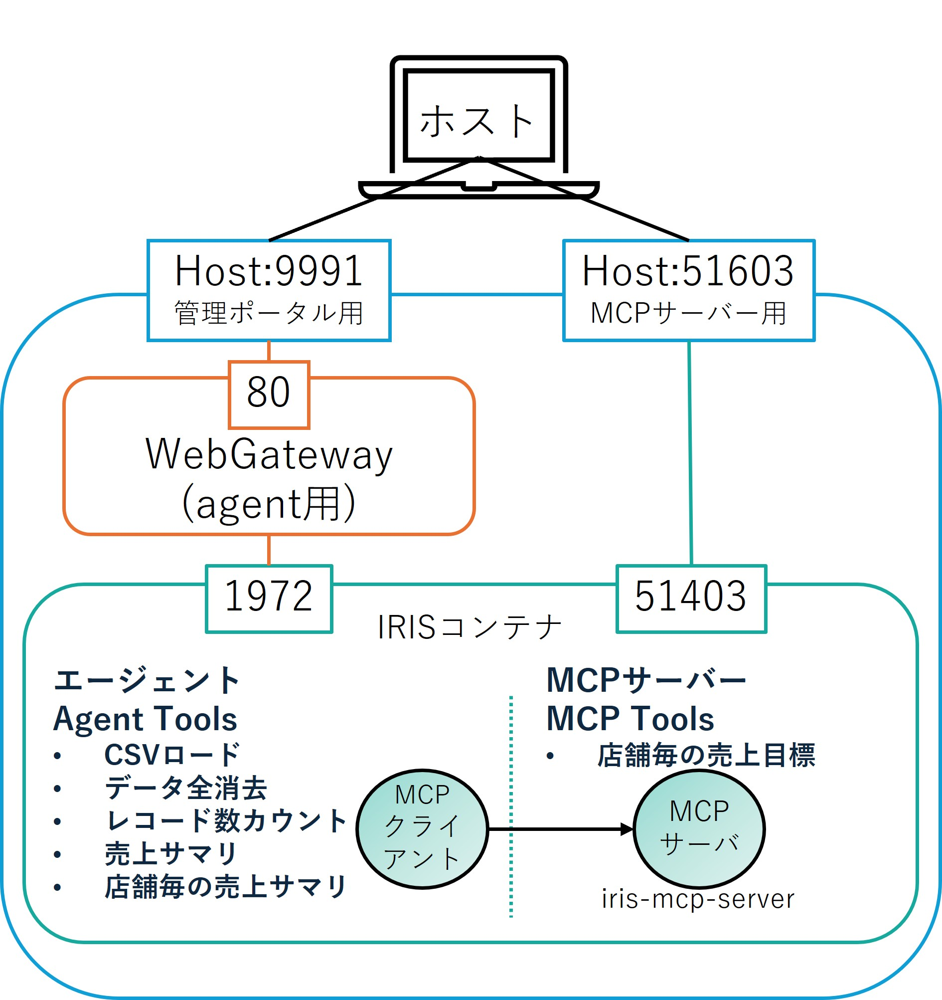


MCP サーバーの設定やツール用クラス定義の作成は、**USERネームスペース**で行います。

MCP サーバー用ツールのクラス定義を VSCode で作成する際、IRIS の接続先ネームスペースを変更する必要があります。

現在は **T1** に接続していますが、ここからは、**USER** に接続を切り替えてクラス定義を作成します。

**InterSystems アイコンをクリック > 接続文字列をクリック > Toggle Connection を選択します。**

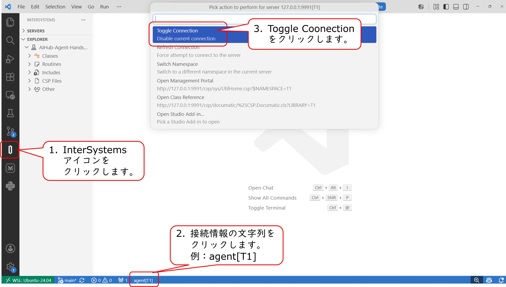

**IRIS へ接続するサーバー文字列：agent を選択し、ネームスペース：USER を選択します。**

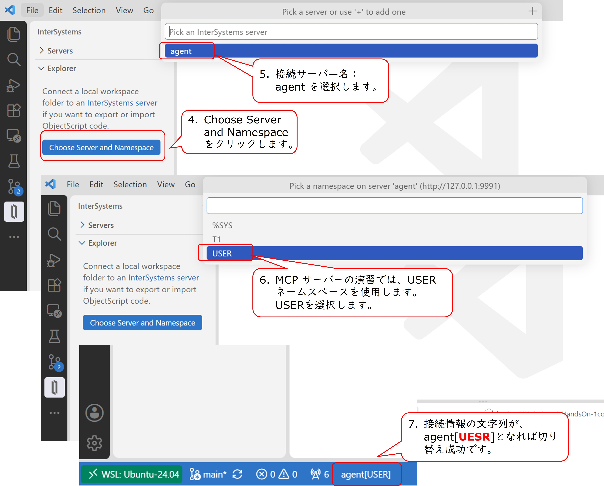

💡画面左下にある接続文字列が **agent[USER]** に変わっていれば切り替え成功です。

#### 3-1. 使用するテーブルの確認

管理ポータルを開き、売上目標が入っているテーブルとデータを確認します。

管理ポータル：http://localhost:9991/csp/sys/UtilHome.csp

ユーザ名、パスワードは以下の通りです。
- ユーザ名：**SuperUser**
- パスワード：**SYS**

**管理ポータル > SQL > USER ネームスペースを選択 > スキーマ：MCPFS > SaleTarget をクエリ実行欄にドラッグ＆ドロップし、実行ボタンをクリック**

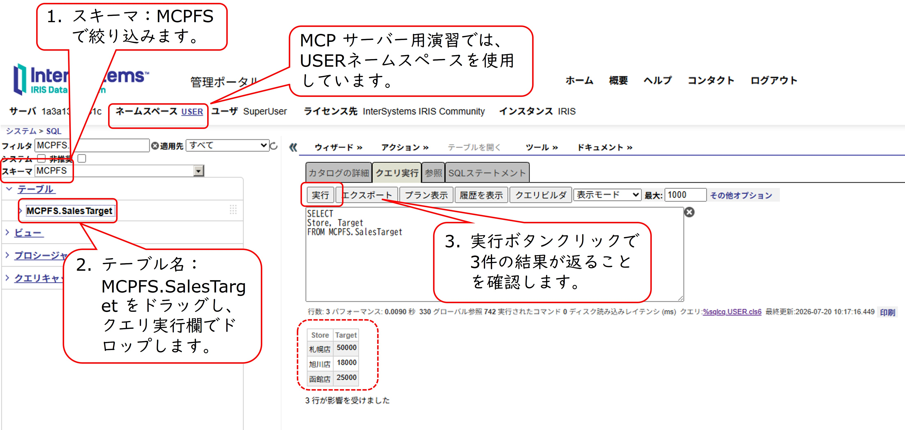

#### 3-2. MCP サーバー用ツールの準備

[agent/src/MCPFS](./agent/src/MCPFS/) ディレクトリの下に、`%AI.Tool` を継承したクラス定義 [`agent/src/MCPFS/Tool.cls`](./agent/src/MCPFS/Tool.cls) を用意しています。

クラス定義を開き、中身を確認します。

VSCode のターミナルを新たに 1 枚開き、MCP サーバー用ネームスペースの IRIS にログインし、どのような結果が返るかテスト実行してみましょう。

MCP サーバー用コンテナへログイン：
```
docker compose exec agent bash
```
IRIS にログイン（USER ネームスペースにログインします）：
```
iris session iris
```
[agent/src/MCPFS/Tool.cls](./agent/src/MCPFS/Tool.cls) にあるツール用メソッドをテスト実行：
```
set modori=##class(MCPFS.Tool).GetStoreSalesTargets()
```
戻り値の JSON ダイナミックオブジェクトを JSON 文字列として表示：
```
do modori.%ToJSON()
```
以下の結果が返ります。
```
{"records":[{"Store":"札幌店","Target":50000},{"Store":"旭川店","Target":18000},{"Store":"函館店","Target":25000}]}
```
この情報を、MCP サーバーのツールとして取得できるように、MCP 用サービスを作成します。

#### 3-3. MCP サービス用クラス作成

[agent/src/MCPFS](./agent/src/MCPFS/) ディレクトリの下に、`%AI.MCP.Service` を継承したクラス定義 `Service.cls` を作成します。

作成したクラスに、Parameter `SPECIFICATION` を設定します。

このパラメータには、MCP サーバーのツールとして使用したいツール用クラス名を指定します（複数ある場合はカンマ区切りで指定します）。
```objectscript
Class MCPFS.Service Extends %AI.MCP.Service
{

/// Service specification, this is a list of one or more toolsets
Parameter SPECIFICATION As STRING = "MCPFS.Tool";

}
```

#### 3-4. MCP サービスクラス用エンドポイントの作成

作成したサービスクラスを使用する**エンドポイント**を管理ポータルを使用して作成します。

> ターミナルから API を利用して作成することもできますが、ここでは管理ポータルの作成方法をご紹介します。

管理ポータルを開きます（開いている画面があればそれを使用します）。：http://localhost:9991/csp/sys/UtilHome.csp

ユーザ名、パスワードは以下の通りです。
- ユーザ名：**SuperUser**
- パスワード：**SYS**

**管理ポータル > システム管理 > セキュリティ > アプリケーション > MCP Servers**

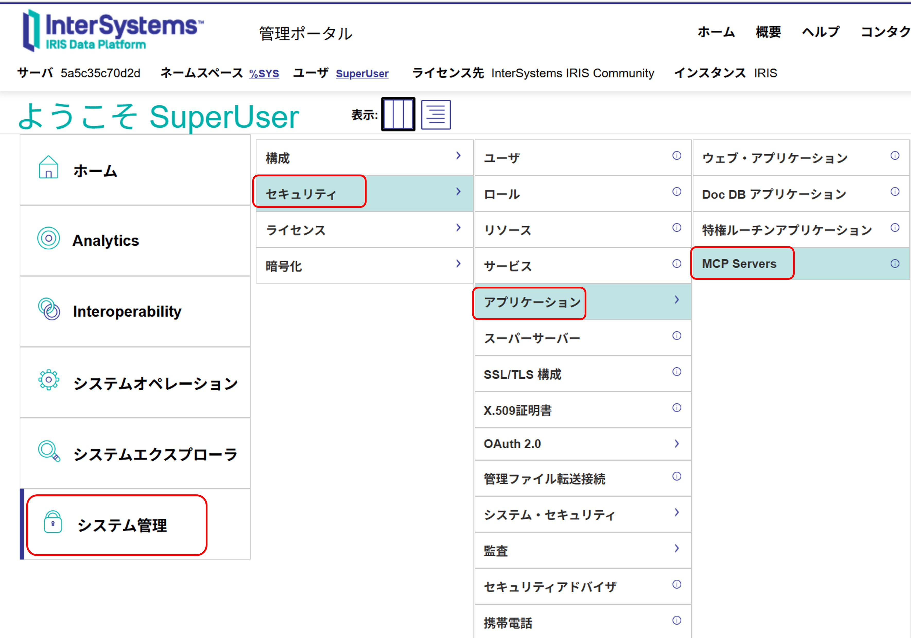

**エンドポイント：/mcp/target を作成します。**

`Create New MCP Server`ボタンをクリックし、以下の内容を入力し保存ボタンをクリックします。

項目|設定値
--|--
名前|/mcp/target
ネームスペース|USER
MCP Service Class| MCPFS.Service
許可された認証方法| 認証なし、パスワード
 
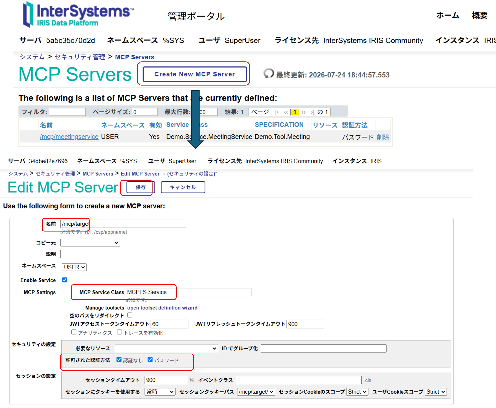

続いて、ハンズオン用の設定をします。

ハンズオンでは、エンドポイントを通過した場合に限り、追加ロールを付与する設定をします。

`アプリケーション` タブを選択します。`利用可能`の一覧から `%All` を選択し、中央の➡をクリックし、`選択済み` に `%All` を移動させます。

最後に、`付与する`ボタンをクリックし、登録完了です。

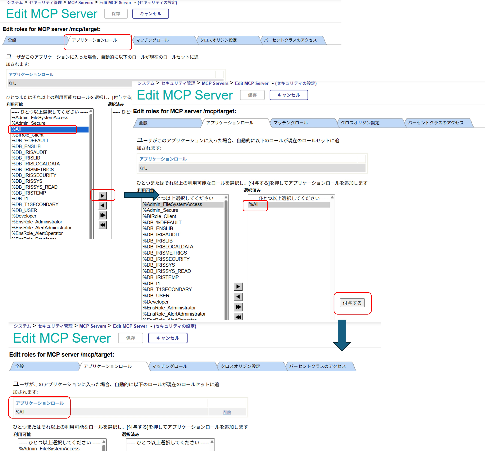


<br>

#### 3-5. MCP サーバーリスタート

新しく追加した MCP サーバー用エンドポイントを、MCP サーバー用構成ファイル：[agent/src/config-http.toml](./agent/src/config-http.toml) に追加します。

[agent/src/config-http.toml](./agent/src/config-http.toml) の `endpoints` に作成したエンドポイント `/mcp/target` の情報を追加します（VSCode でファイルを開き修正します）。
```
endpoints = [
  { path = "/mcp/meetingservice", username="SuperUser",password="SYS"},
  { path = "/mcp/target", username="SuperUser",password="SYS"},

]
```
> - **📝メモ1**：`/mcp/meetingservice` は、デモ用アプリケーションで使用しているエンドポイントです。
>
> - **📝メモ2**：VSCodeで修正するファイルが含まれるディレクトリ `./agent/src` は、コンテナ内の `/opt/app` ディレクトリをボリュームマウントしているため、VSCode で修正した内容をそのままコンテナでも利用できます。

エンドポイント追加後、`iris-mcp-server` を再開始します。

開始の基本は、`iris-mcp-server --config=config-http.toml run` ですが、ログファイルなどを指定するため、シェルに処理をまとめています。

以下、リスタート用シェルを起動します。

コンテナにログインしているターミナルで以下実行します。

IRIS にログインしている場合は、`halt` コマンドで IRIS からログアウトできます。
```
USER>halt
irisowner@38a3cda500f8:/opt/src$
```
コンテナ内で以下実行します。
```
cd /opt/app
./restart-mcp.sh
```

> 停止に少し時間がかかります。

シェル実行例は以下の通りです。
```
irisowner@1a3a13b5a31c:/opt/app$ ./restart-mcp.sh 
Stopping iris-mcp-server. PID=186481
Still running. Sending SIGTERM...
Still running. Sending SIGKILL...
Starting iris-mcp-server...
iris-mcp-server started. PID=188323
irisowner@1a3a13b5a31c:/opt/app$ 
```
#### 3-6. MCP サーバのテスト

VSCode で [agent/src/MCPFS/mcptest.http](./agent/src/MCPFS/mcptest.http) を開き、テストします。

> ホストからコンテナの MCP サーバーへの接続テストを行うため、VSCode で [agent/src/MCPFS/mcptest.http](./agent/src/MCPFS/mcptest.http) を直接開き、実行します。

このファイルは、VSCode の [RESTクライアントエクステンション](https://marketplace.visualstudio.com/items?itemName=humao.rest-client)を使用しています。

💡**[RESTクライアントエクステンション](https://marketplace.visualstudio.com/items?itemName=humao.rest-client)をインストールしてからお試しください。**

最初に、MCP サーバーとのイニシャライズを実行します。

[agent/src/mcptest.http](./agent/src/mcptest.http) の2行目のすぐ下に `Send Request` のマークが表示されるので、クリックすると結果が新しいウィンドウで表示されます。

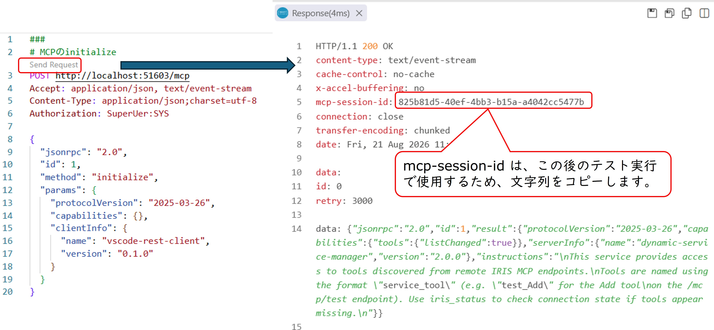

次に、ツールのリストを取得します（22行目以降）。

イニシャライズ処理で作成される `mcp-session-id` をコピーし、26行目に貼り付けてから実行します。　

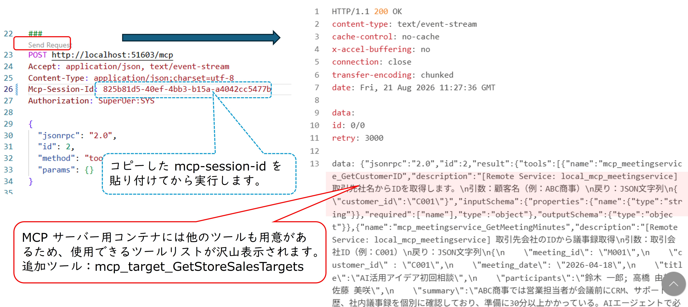

`mcp_target_GetStoreSalesTargets` が表示されれば正しくツールが認識されています。

ツールをテスト実行します（37 行目以降）。

イニシャライズ処理で作成される `mcp-session-id` をコピーし、41 行目に貼り付けてから実行します。　

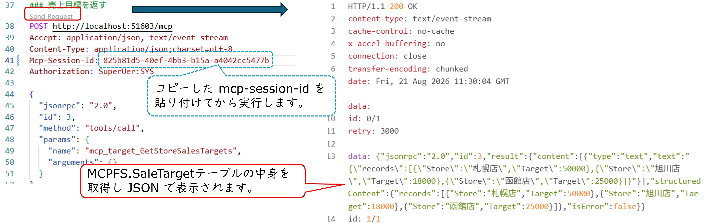

今回追加したツールは、`MCPFS.SalesTarget` テーブルの中身を JSON で返します。

正しく返送されましたか？

#### 🤖まとめ

MCP サーバー用ツールも、通常のツールも `%AI.Tool` クラスを継承したクラスを用意し、実行したい内容をクラスメソッド化すれば実装できることを確認できました。

MCP サーバーのツールとして実行する場合には、用意したツールクラスを `%AI.MCP.Service` 継承した MCP サービスクラスに登録し、MCP サーバー用エンドポイントで使用するディスパッチクラスとして設定するだけです。

後は、MCP サーバー構成ファイル（例：[agent/src/config-http.toml](./agent/src/config-http.toml)）を用意して、`iris-mcp-server` の引数に指定して `run` するだけです。

手続きが決まっているので、思ったよりも簡単ですね！


### 4. エージェントから MCP サーバー用ツールを利用する

- ■■■ 今回やること ■■■

    □ AI とチャットする

    □ エージェントの作成

    □ ツールの追加

    □ MCP 追加

    ■ 完成

---

いよいよハンズオン最後の手続きです。

ハンズオンで作成したエージェントから、作成した MCP サーバー用ツールを呼び出すように設定変更します。

ここからは、**VSCode の接続先をエージェント用ネームスペース：T1 に切り換え、クラス定義を修正します。**

接続文字列をクリックし、`Toggle Connection` を選択します。

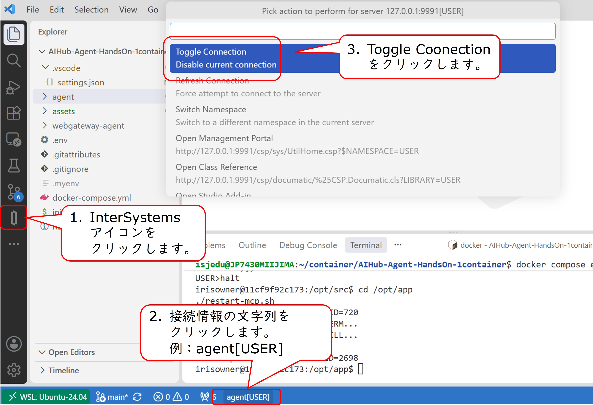

接続文字列：agent を選択し、ネームスペース：T1 に切り換えます。

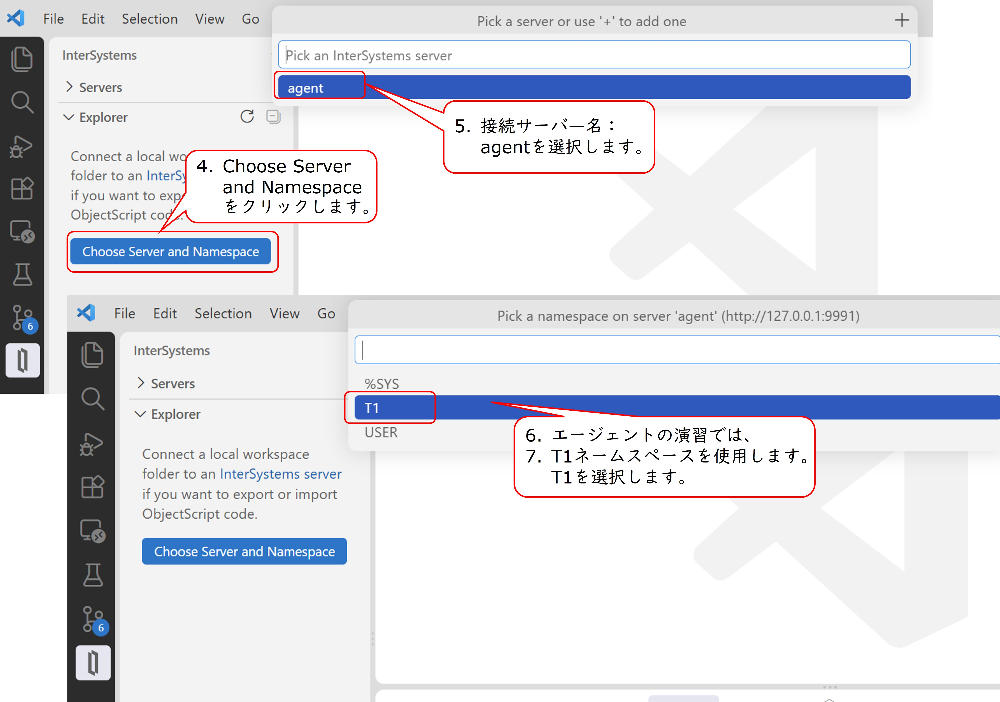


#### 4-1. ToolSet クラスの用意

[agent/src/FS](./agent/src/FS/) ディレクトリに移動し、`%AI.ToolSet` を継承したクラス：`ToolSet.cls` を作成します。

クラス定義文は以下の通りです。
```
Class FS.ToolSet Extends %AI.ToolSet
```

続いて、リモート MCP サーバーのエンドポイントを使用するように設定します。

以下の XData ブロックをクラス定義内にコピーし、保存します（Ctrl + s）。

```
XData Definition [ MimeType = application/xml ]
{
    <ToolSet Name="SalesTarget">
        <Description>
        営業目標を取得できるツール
        </Description>
        <MCP Name="RemoteServer">
            <Remote URL="http://localhost:51403/mcp/"
                AuthType="basic"
                Username="SuperUser"
                Password="SYS"
            />
        </MCP>
    </ToolSet>
}
```

#### 4-2. エージェントの TOOLSETS を更新

最後に、エージェントクラス：[agent/src/FS.AgentTest.cls](./agent/src/FS/AgentTest.cls) を開き、パラメータ：`TOOLSETS` を修正します。

現在は、`FS.Tool` クラスのみの登録ですが、作成したツールセットクラス：`FS.ToolSet` カンマで区切って追加します。
```
Parameter TOOLSETS = "FS.Tool,FS.ToolSet";
```

クラス定義を保存します（Ctrl + s）。


#### 4-3. テスト！

コンテナの IRIS にログインし、早速エージェントをテストします。

質問を **"/opt/app/FS/SalesData.csv 店舗別の売上実績と売上目標を比較し、経営者が確認すべき店舗を教えて。"** に変更してから実行してください。
```
    // 質問サンプル
    //set question="/opt/app/FS/SalesData.csv この売上データの特徴を教えて。"
    //set question="/opt/app/FS/SalesData.csv 店舗別の売上を比較して、特徴を教えて。"
    set question="/opt/app/FS/SalesData.csv 店舗別の売上実績と売上目標を比較し、経営者が確認すべき店舗を教えて。"
    //set question="/opt/app/FS/SalesData.csv この売上データの特徴と改善できそうな点があれば教えて。"

```

コンテナにログイン（ログイン済ターミナルがあればそれを利用してください。）
```
docker compose exec agent bash
```
IRIS の T1 ネームスペースにログイン（ログイン済ターミナルがあればそれを利用してください。）
```
iris session iris -U T1
```
テスト実行
```
do ##class(FS.AgentTest).TestChat()
```

利用可能ツールの表示に、MCP サーバー用ツール（mcp_target_GetStoreSalesTargets）が追加されたでしょうか。

また、使用したツールに **Local Toolだけではなく mcp_target_GetStoreSalesTargets が利用されたことを確認してください。**

<details><summary><b>🔍実行例（クリックすると展開されます）</b></summary>
<div>

```
T1>do ##class(FS.AgentTest).TestChat()

利用可能ツールの表示

{"Summary":"利用可能なツールはfunctions名前空間の各関数です。売上データの分析、CSVロード、データクリア、件数カウントなどの機能を提供します。","Evidence":["functions.ClearData: FS.SalesDataテーブルのデータを全消去","functions.LoadCSV: CSVファイルの中身をFS.SalesDataにロード","functions.RecordCount: FS.SalesDataのレコード数カウント","functions.GetSalesSummary: 売上データ全体の集計情報取得","functions.AnalyzeSalesByStore: 店舗ごとの売上分析"],"CallTools":[]}


分析実行

{"Summary":"CSVデータの売上実績を店舗別に集計し、売上目標と比較しました。札幌店の平均売上額は約42286円で目標の50000円に届いていません。旭川店の平均売上額は約18333円で目標18000円にほぼ達しています。函館店の平均売上額は約25350円で目標25000円を若干上回っています。経営者が特に注意すべきは、目標に達していない札幌店で、改善策の検討が必要です。","Evidence":["札幌店: 平均売上約42286円, 目標50000円","旭川店: 平均売上約18333円, 目標18000円","函館店: 平均売上約25350円, 目標25000円"],"CallTools":["functions.ClearData","functions.LoadCSV","functions.AnalyzeSalesByStore","functions.mcp_target_GetStoreSalesTargets"]}

```
</div>
</details>
<br>

#### 🤖まとめ

エージェントで使用するツールは、MCP サーバー用ツールでも、ローカルのツールでも、パラメータ：`TOOLSETS` に指定すれば、エージェントが利用できることを確認できました。

ツール作成方法については、MCP サーバー用ツールもローカルツールも同様の作成方法であることを確認できました。

ハンズオンを通して、以下の内容を理解できました。

- `%AI.Agent` でエージェントを作成できる。
- Sessionで会話履歴を保持できる。
- `%AI.Tool` でローカルツールを作れる
- `%AI.MCP.Service` で MCP サーバーを公開できる
- `%AI.ToolSet` でリモート MCP を利用できる
- エージェントは、**必要な Tool を自律的に選択して実行する**
  
<br>

**🎉完成！売上分析AIエージェント**
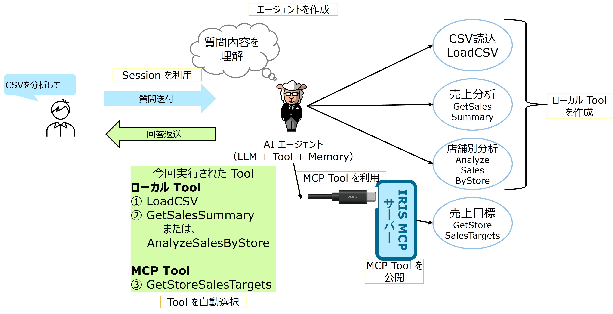

お疲れ様でした！

---
## ☕付録：デモのエージェント開始方法

コンテナにログインし、以下実行します。

コンテナにログイン
```
docker compose exec agent bash
```
ソースコードがあるディレクトリに移動します（以下の例は、第1回ウェビナーのWebアプリを起動します）。
```
cd ../app/web1
```
> Human in the Loop のデモは `cd ../app/web2` に移動します。Web アプリ実行方法は共通です。

irispython コマンドを利用して実行します。
```
/usr/irissys/bin/irispython -m uvicorn main:app --host 0.0.0.0 --port 8000 --reload
```

> [!Note] 
> デモの Web アプリケーションから IRIS へは、Embedded Python を利用しています。そのため、アプリの実行に `irispython` を使用しています。
> 
> 💡**メモ**：`irispython` は、IRIS の Embedded Python で利用するパッケージをインポートできるように用意された IRIS 専用 Python コマンドです。
> Embedded Python について詳しくは、[ウェビナー「Pythonでデータベースプログラミング(2023年4月26日開催分)」](https://www.youtube.com/watch?v=fMxWwf3alNY&list=PLzSN_5VbNaxB39_H2QMMEG_EsNEFc0ASz&index=3)や[セルフラーニングビデオ](https://jp.community.intersystems.com/node/520751)をご参照ください。

<br>

ブラウザで http://localhost:8000 を開くと、以下の画面が表示されます。

- [agent/src/web1](./agent/src/web1/) の例
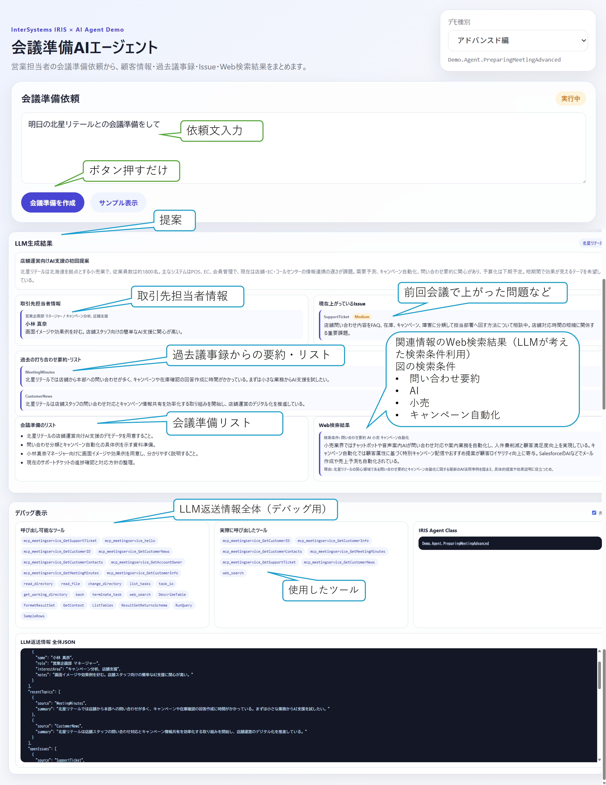

- [agent/src/web2](./agent/src/web2/)：レビュー依頼画面と承認画面が追加された Human in the Loop 版
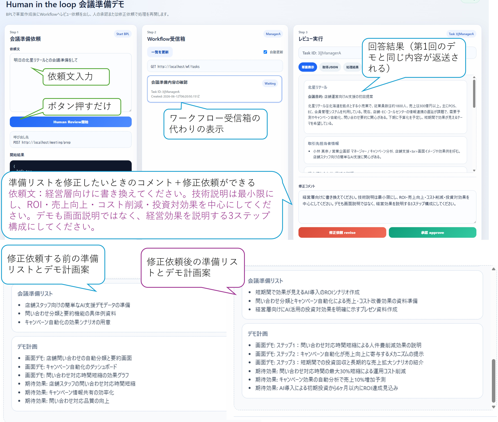

## ☕付録：MCPサーバを試す

MCP サーバのツールを単体でテストする方法を説明します。

### A. [MCP インスペクタ](https://modelcontextprotocol.io/docs/tools/inspector)で試す

前提：Node が実行環境にインストールされていること。

手順：Windows の場合は、コマンドプロンプトで以下実行します。

```
npx @modelcontextprotocol/inspector@v1-latest
```
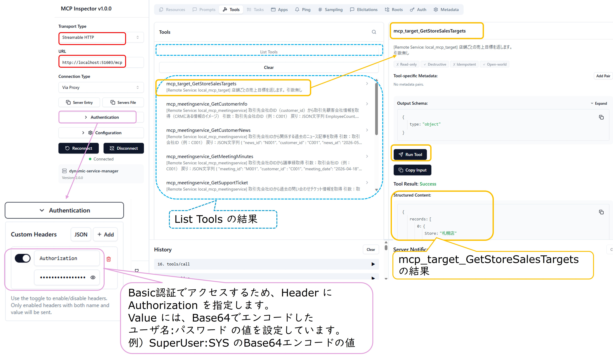

設定は以下の通り：

TransportType | URL
--|--
Streamable HTTP| http://localhost:51603/mcp


### C. Claude Desktopを使う

開発者用設定の `claude_desktop_config.json` に以下追記します。

> AUTH_HEADER に指定しているのは、エンドポイントへのパスワード認証のユーザ名、パスワードのBase64エンコードの値です。
```
    "iris-targetservice": {
      "command": "npx",
      "args": [
        "mcp-remote",
        "http://localhost:51603/mcp",
        "--header",
        "Authorization:${AUTH_HEADER}"
      ],
      "env": {
        "AUTH_HEADER": "Basic U3VwZXJVc2VyOlNZUw=="
      }
    },
```
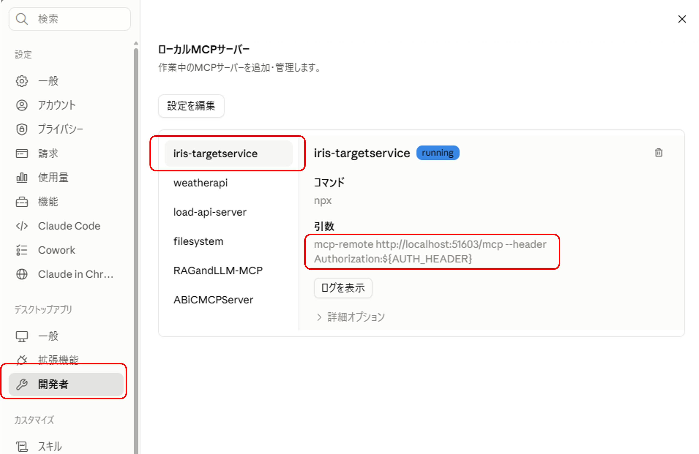

Claude Desktopを終了します（×で閉じるのではなく、**ファイル > 終了** を選択します）。

Claude Desktop 再起動後、チャット欄に `店舗ごとの売上目標を返して` と依頼すると、MCP ツールを利用して情報収集し、回答を作成します。

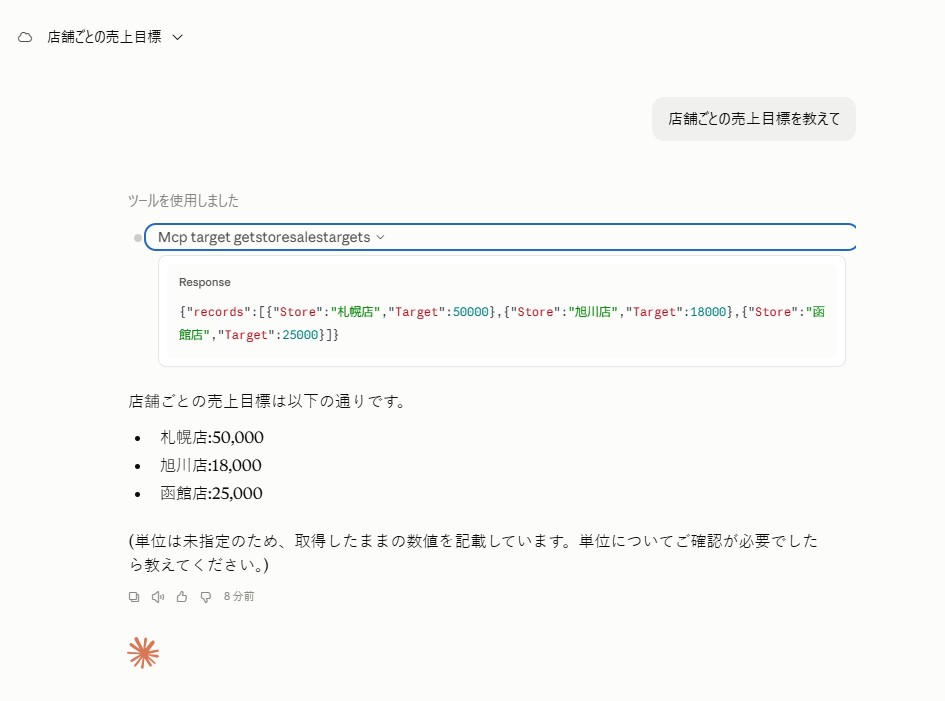

<br>

---
🤖この README が ObjectScript SDK を使った AI エージェント開発の参考になれば幸いです。